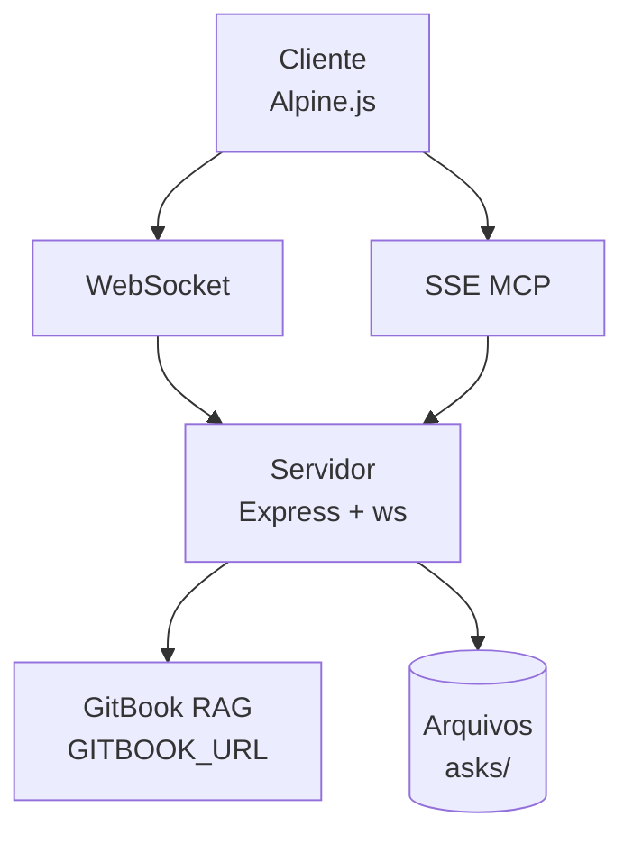

# 💬 GitBook Chat

> Chat interface que consulta documentação GitBook e salva respostas como `.md`.
> Stateless, fonte RAG fixa, com servidor MCP SSE integrado.

<!-- 1.LINGUAGENS | 2.PACKAGE_MANAGERS | 3.FRAMEWORKS | 4.BIBLIOTECAS | 5.TESTES | 6.AMBIENTE | 7.PIPELINE | 8.DEPLOY -->

       

---

## 🎯 Sobre o Projeto

Aplicação stateless que consulta uma documentação GitBook fixa (`GITBOOK_URL`) e salva as respostas como arquivos `.md` no diretório `asks/`.

Cada pergunta é independente — não há memória de interações anteriores. A fonte RAG é fixa: toda consulta faz `?ask=` contra a mesma URL. O `welcome.md` é uma cópia local commitada do README original, servida como ponto de partida. Nunca é refetchada.

Inclui um servidor MCP (Model Context Protocol) via SSE, permitindo que ferramentas como opencode consultem o GitBook, listem buscas anteriores e naveguem pelo histórico — tudo no mesmo processo, porta 8000.

> [!WARNING]
> APLICAÇÃO RODA EM CIMA DE UM BUG/FALHA
> A API de IA do GitBook usada como fonte RAG é pública e sem autenticação
> Só tem um rate limit de 20 requisições a cada 5 minutos.
> O servidor não acumula fila — requisições excedentes falham.

---

## 📦 Pré-requisitos

- Node.js 20+ — verifique com `node --version`
- Docker 24+ — verifique com `docker --version`

---

## 🚀 Instalação

### Instale as dependências

```bash
cp .env.example .env
# edite GITBOOK_URL no .env

docker compose run --rm gitbook-chat npm install
```

### Execute a aplicação

```bash
docker compose up -d --build
```

Acesse em: `http://localhost:8000`

---

## 🔐 Variáveis de Ambiente

| Variável       | Descrição                                            |
|----------------|------------------------------------------------------|
| `GITBOOK_URL`  | URL da documentação GitBook (fonte RAG fixa)         |

---

## 📁 Estrutura do Projeto

```
├── server.js          # API REST + WebSocket + MCP SSE
├── package.json
├── docker-compose.yml
├── .env.example
├── public/
│   ├── index.html     # UI Alpine.js + Tailwind
│   └── app.js         # lógica do chat
├── tests/
│   └── api.test.js    # testes de API
├── asks/              # respostas persistidas
├── scripts/
│   └── seed-questions.js
└── welcome.md         # conteúdo inicial (cópia local)
```

---

## 🧪 Testes

```bash
docker exec gitbook-chat npm test
```

---

## 🌐 API Endpoints

| Método | Rota                         | Descrição                              |
|--------|------------------------------|----------------------------------------|
| GET    | `/api/history`               | Lista perguntas (paginação)            |
| GET    | `/api/history/:file`         | Conteúdo de uma resposta salva         |
| GET    | `/download/readme.md`        | Download do welcome.md                 |
| WS     | `/`                          | Chat via WebSocket                     |
| GET    | `/sse`                       | SSE endpoint (MCP — inicia sessão)     |
| POST   | `/mcp?sessionId={id}`        | Mensagens JSON-RPC do MCP              |

### MCP Tools

| Tool | Descrição |
|------|-----------|
| `query_gitbook(question)` | Pergunta à documentação GitBook (fonte RAG fixa) |
| `list_asks(page?, limit?, order?)` | Lista perguntas salvas com paginação |
| `get_ask(filename)` | Conteúdo completo de uma resposta |
| `search_asks(term)` | Busca termo nas respostas salvas |
| `get_welcome()` | Retorna o welcome.md |

---

## 🏗️ Arquitetura


